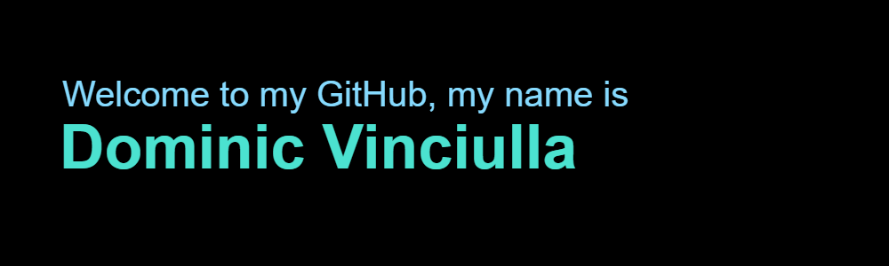

    

  I am a second year computer science student at [Rochester Institute of Technology](https://www.rit.edu) and I am on the lookout for software engineering co-ops in the Northeastern United States for this Summer!

  Here are my skills, in order of proficiency!

  

<!--
**dmv1167/dmv1167** is a ✨ _special_ ✨ repository because its `README.md` (this file) appears on your GitHub profile.

Here are some ideas to get you started:

- 🔭 I’m currently working on ...
- 🌱 I’m currently learning ...
- 👯 I’m looking to collaborate on ...
- 🤔 I’m looking for help with ...
- 💬 Ask me about ...
- 📫 How to reach me: ...
- 😄 Pronouns: ...
- ⚡ Fun fact: ...
-->
